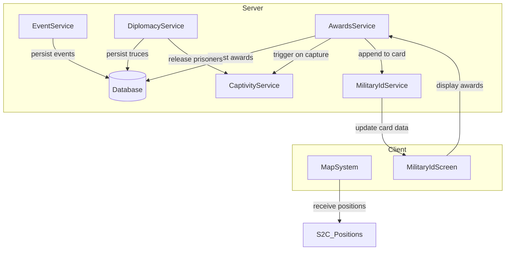
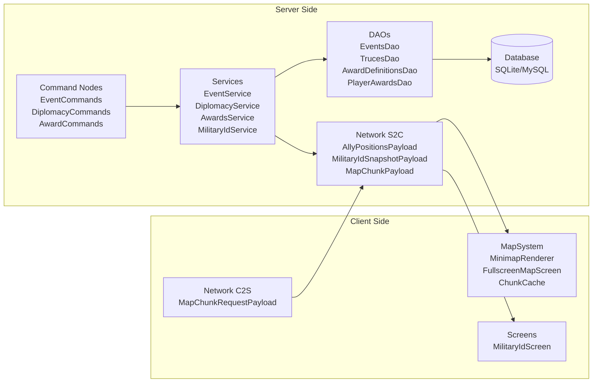

# Design Document: Military Features Expansion

## Overview

This design covers five interconnected systems for the War Project NeoForge 1.21.1 mod (Java 21):

1. **3D Map & Minimap** — Client-side terrain/player rendering with chunk caching and async loading
2. **Military ID Card (Военный билет)** — DataComponent-based item with lifecycle tied to faction membership
3. **Event System (Система ивентов)** — Admin-managed events with teleportation and participant tracking
4. **Diplomacy System** — Truces, prisoner exchanges, and negotiation channel between factions
5. **Awards/Medals System (Система наград)** — Definitions, manual/automatic granting, and display

All systems follow existing architectural patterns: constructor-injected services, JDBC DAOs with `Connection` parameter, record-based `CustomPacketPayload` payloads, `DataComponentType` with Codec/StreamCodec, and `ModConfigSpec` configuration.

### Integration Points



The Awards system hooks into CaptivityService via event listeners for automatic triggers. The Diplomacy system invokes CaptivityService for prisoner exchanges. The Military ID service listens to rank/subdivision/award changes to keep the card item synchronized.

---

## Architecture

### High-Level Component Diagram



### Package Structure (new packages)

```
com.frostlogic.warproject
├── client/
│   ├── map/                          # Map system (client-only)
│   │   ├── MapSystem.java            # Orchestrator, keybind registration
│   │   ├── MinimapRenderer.java      # HUD overlay renderer
│   │   ├── FullscreenMapScreen.java  # Full-screen map Screen
│   │   ├── ChunkCache.java           # LRU chunk data cache
│   │   ├── MapChunkData.java         # Cached heightmap + block data for one chunk
│   │   └── RaycastUtil.java          # Block-level raycast for enemy visibility
│   └── screen/
│       └── MilitaryIdScreen.java     # Military ID display screen
├── server/
│   ├── event/                        # Event system
│   │   ├── EventService.java
│   │   ├── EventState.java           # Enum: PENDING, ACTIVE, COMPLETED
│   │   └── EventData.java            # In-memory event representation
│   ├── diplomacy/                    # Diplomacy system
│   │   ├── DiplomacyService.java
│   │   ├── TruceState.java           # Active truce tracking
│   │   └── ExchangeProposal.java     # Pending exchange data
│   ├── award/                        # Awards system
│   │   ├── AwardsService.java
│   │   ├── AwardDefinition.java      # Record for award metadata
│   │   └── AwardTrigger.java         # Automatic trigger evaluation
│   ├── militaryid/                   # Military ID system
│   │   ├── MilitaryIdService.java
│   │   ├── MilitaryIdData.java       # DataComponent record
│   │   └── MilitaryIdComponentTypes.java
│   └── command/nodes/
│       ├── EventCommands.java
│       ├── DiplomacyCommands.java
│       └── AwardCommands.java
├── network/payload/
│   ├── s2c/
│   │   ├── AllyPositionsPayload.java
│   │   ├── MilitaryIdSnapshotPayload.java
│   │   └── MapChunkPayload.java
│   └── c2s/
│       └── MapChunkRequestPayload.java
└── persistence/dao/
    ├── EventsDao.java
    ├── EventParticipantsDao.java
    ├── TrucesDao.java
    ├── AwardDefinitionsDao.java
    └── PlayerAwardsDao.java
```

---

## Components and Interfaces

### 1. Map System (Client-Side)

#### MapSystem

Orchestrator registered during client setup. Manages keybinds, tick updates, and renderer lifecycle.

```java
public final class MapSystem {
    private final MinimapRenderer minimap;
    private final ChunkCache chunkCache;
    private boolean minimapVisible;
    private KeyMapping toggleMinimapKey;
    private KeyMapping openFullscreenKey;

    public void onClientTick(ClientTickEvent.Post event);
    public void onRenderHud(RenderGuiLayerEvent.Post event);
    public void onChunkLoad(ChunkEvent.Load event);
    public void onChunkUnload(ChunkEvent.Unload event);
    public void handleAllyPositions(AllyPositionsPayload payload);
    public void handleMapChunk(MapChunkPayload payload);
}
```

#### MinimapRenderer

Renders the 128×128 minimap widget on the HUD. Uses cached heightmap data to draw terrain with height-based shading. Renders ally/enemy markers and territory borders.

```java
public final class MinimapRenderer {
    public void render(GuiGraphics graphics, int screenWidth, int screenHeight,
                       BlockPos playerPos, float playerYaw,
                       List<AllyPosition> allies, List<EnemyPosition> enemies,
                       ChunkCache cache, int radius, CornerPosition corner);
}
```

#### ChunkCache

LRU cache of `MapChunkData` keyed by `ChunkPos`. Thread-safe for async loading.

```java
public final class ChunkCache {
    private final int maxSize; // from config, default 1024
    private final ConcurrentLinkedHashMap<ChunkPos, MapChunkData> cache;

    public @Nullable MapChunkData get(ChunkPos pos);
    public void put(ChunkPos pos, MapChunkData data);
    public void invalidate(ChunkPos pos);
    public int size();
}
```

#### FullscreenMapScreen

Extends `Screen`. Supports zoom (3+ levels), pan (drag), coordinate display. Does not pause game.

```java
public class FullscreenMapScreen extends Screen {
    private int zoomLevel; // 0=closest (64 blocks), max=farthest (full radius)
    private double panOffsetX, panOffsetZ;
    private static final int MAX_ALLIES_DISPLAYED = 50;

    @Override public boolean isPauseScreen() { return false; }
    @Override public boolean mouseScrolled(...); // zoom
    @Override public boolean mouseDragged(...); // pan
}
```

### 2. Military ID System

#### MilitaryIdData (DataComponent)

```java
public record MilitaryIdData(
    String passportIdRef,    // max 64 chars
    String faction,          // FactionId string
    String rankId,           // max 64 chars
    String subdivision,      // max 64 chars, "" if unassigned
    List<String> awards,     // max 32 entries, each max 64 chars
    String enlistmentDate,   // "dd.MM.yyyy"
    String acceptingOfficer  // max 64 chars
) {
    public static final MilitaryIdData EMPTY = new MilitaryIdData("", "", "", "", List.of(), "", "");
    public static final Codec<MilitaryIdData> CODEC = RecordCodecBuilder.create(...);
    public static final StreamCodec<RegistryFriendlyByteBuf, MilitaryIdData> STREAM_CODEC = ...;
}
```

#### MilitaryIdService

```java
public final class MilitaryIdService {
    private final Database database;
    private final PassportsDao passportsDao;

    public void issueCard(ServerPlayer player, FactionId faction, String rankId,
                          String subdivision, String acceptingOfficer);
    public void updateRank(ServerPlayer player, String newRankId);
    public void updateSubdivision(ServerPlayer player, String subdivisionName);
    public void appendAward(ServerPlayer player, String awardName);
    public void syncOnLogin(ServerPlayer player);
    
    // Internal: scans inventory for card matching player's passport ID
    private @Nullable ItemStack findCard(ServerPlayer player);
}
```

### 3. Event System

#### EventService

```java
public final class EventService {
    private final Database database;
    private final EventsDao eventsDao;
    private final EventParticipantsDao participantsDao;
    private final AuditLogDao auditLogDao;

    // In-memory active event state
    private volatile @Nullable EventData activeEvent;

    public Result<EventData> create(String name, UUID creatorUuid);
    public Result<Void> setSpawn(UUID adminUuid, BlockPos pos, ResourceKey<Level> dimension);
    public Result<Void> start(UUID adminUuid);
    public Result<Void> stop(UUID adminUuid, MinecraftServer server);
    public Result<Void> join(ServerPlayer player);
    public Result<Void> delete(String name);
    public @Nullable EventData getActiveEvent();
}
```

#### EventData

```java
public record EventData(
    int id,
    String name,
    EventState status,
    UUID creatorUuid,
    @Nullable BlockPos spawnPos,
    @Nullable ResourceKey<Level> dimension,
    long createdAt,
    @Nullable Long completedAt,
    Set<UUID> participants  // in-memory only during ACTIVE
) {}
```

### 4. Diplomacy System

#### DiplomacyService

```java
public final class DiplomacyService {
    private final Database database;
    private final TrucesDao trucesDao;
    private final CaptivityService captivityService;
    private final AuditLogDao auditLogDao;

    // In-memory state
    private volatile @Nullable TruceState activeTruce;
    private volatile @Nullable TruceProposal pendingTruceProposal;
    private volatile @Nullable ExchangeProposal pendingExchange;

    // Truce
    public Result<Void> proposeTruce(ServerPlayer general, int durationMinutes);
    public Result<Void> acceptTruce(ServerPlayer general);
    public Result<Void> breakTruce(ServerPlayer general);
    public boolean isTruceActive();
    public void tickTruce(MinecraftServer server); // called each server tick

    // Prisoner Exchange
    public Result<Void> proposeExchange(ServerPlayer general, String ownPrisoner, String enemyPrisoner);
    public Result<Void> acceptExchange(ServerPlayer general);
    public Result<Void> rejectExchange(ServerPlayer general);

    // Negotiation Channel
    public Result<Void> sendDiplomacyMessage(ServerPlayer sender, String message);

    // PvP hook
    public boolean shouldCancelPvP(ServerPlayer attacker, ServerPlayer victim);
}
```

#### TruceState

```java
public record TruceState(
    FactionId proposingFaction,
    FactionId targetFaction,
    int durationMinutes,
    long startedAt,
    int dbId
) {
    public boolean isExpired() {
        return System.currentTimeMillis() > startedAt + (durationMinutes * 60_000L);
    }
}
```

### 5. Awards System

#### AwardsService

```java
public final class AwardsService {
    private final Database database;
    private final AwardDefinitionsDao definitionsDao;
    private final PlayerAwardsDao playerAwardsDao;
    private final AuditLogDao auditLogDao;
    private final MilitaryIdService militaryIdService;

    // Admin operations
    public Result<AwardDefinition> createAward(String name, String description);
    public Result<Void> deleteAward(String name);
    public List<AwardDefinition> listAwards();

    // Granting
    public Result<Void> grantAward(String awardName, UUID targetUuid, UUID grantedByUuid, FactionId grantingFaction);
    public List<PlayerAward> getPlayerAwards(UUID playerUuid);

    // Automatic triggers
    public void evaluateTrigger(String triggerType, ServerPlayer player);
    public void onCaptureSuccess(ServerPlayer captor); // called from event listener
}
```

#### AwardDefinition

```java
public record AwardDefinition(
    int id,
    String name,
    String description,
    String iconId,
    long createdAt
) {}
```

---

## Data Models

### Database Schema (Migration V2__military_features.sql)

```sql
-- WarProject schema V2: military features expansion
-- Token ${AI} is replaced at runtime with AUTOINCREMENT (SQLite) or AUTO_INCREMENT (MySQL)

-- events
CREATE TABLE IF NOT EXISTS events (
    id              INTEGER     NOT NULL PRIMARY KEY ${AI},
    name            VARCHAR(64) NOT NULL,
    status          VARCHAR(16) NOT NULL,
    creator_uuid    CHAR(36)    NOT NULL,
    spawn_x         INTEGER,
    spawn_y         INTEGER,
    spawn_z         INTEGER,
    spawn_dimension VARCHAR(128),
    created_at      BIGINT      NOT NULL,
    completed_at    BIGINT,
    participant_count INTEGER   NOT NULL DEFAULT 0
);
CREATE INDEX IF NOT EXISTS idx_events_status ON events(status);
CREATE INDEX IF NOT EXISTS idx_events_creator ON events(creator_uuid);

-- event_participants
CREATE TABLE IF NOT EXISTS event_participants (
    event_id        INTEGER     NOT NULL,
    player_uuid     CHAR(36)    NOT NULL,
    joined_at       BIGINT      NOT NULL,
    PRIMARY KEY (event_id, player_uuid),
    CONSTRAINT fk_ep_event FOREIGN KEY (event_id) REFERENCES events(id) ON DELETE CASCADE
);

-- truces
CREATE TABLE IF NOT EXISTS truces (
    id                  INTEGER     NOT NULL PRIMARY KEY ${AI},
    proposing_faction   VARCHAR(16) NOT NULL,
    target_faction      VARCHAR(16) NOT NULL,
    duration_minutes    INTEGER     NOT NULL,
    started_at          BIGINT      NOT NULL,
    ended_at            BIGINT,
    status              VARCHAR(16) NOT NULL
);
CREATE INDEX IF NOT EXISTS idx_truces_status ON truces(status);

-- award_definitions
CREATE TABLE IF NOT EXISTS award_definitions (
    id              INTEGER      NOT NULL PRIMARY KEY ${AI},
    name            VARCHAR(64)  NOT NULL UNIQUE,
    description     VARCHAR(256) NOT NULL,
    icon_id         VARCHAR(64)  NOT NULL DEFAULT 'default_medal',
    created_at      BIGINT       NOT NULL
);

-- player_awards
CREATE TABLE IF NOT EXISTS player_awards (
    id              INTEGER     NOT NULL PRIMARY KEY ${AI},
    player_uuid     CHAR(36)    NOT NULL,
    award_id        INTEGER     NOT NULL,
    granted_by_uuid CHAR(36)    NOT NULL,
    granted_at      BIGINT      NOT NULL,
    CONSTRAINT fk_pa_award FOREIGN KEY (award_id) REFERENCES award_definitions(id),
    CONSTRAINT uq_player_award UNIQUE (player_uuid, award_id)
);
CREATE INDEX IF NOT EXISTS idx_pa_player ON player_awards(player_uuid);
CREATE INDEX IF NOT EXISTS idx_pa_award ON player_awards(award_id);
```

### Network Payloads

| Payload | Direction | Purpose | Fields |
|---------|-----------|---------|--------|
| `AllyPositionsPayload` | S2C | Periodic ally positions for minimap | `List<AllyPosition>` (uuid, x, y, z, factionId) max 100 |
| `EnemyVisiblePayload` | S2C | Visible enemy positions (server-validated raycast) | `List<EnemyPosition>` (x, y, z, factionId) |
| `MapChunkPayload` | S2C | Chunk heightmap data for map rendering | `ChunkPos`, `int[] heightmap` (256 entries), `int[] blockColors` |
| `MapChunkRequestPayload` | C2S | Client requests chunk data for map | `ChunkPos` |
| `MilitaryIdSnapshotPayload` | S2C | Military ID data for display screen | `MilitaryIdData` |

### Data Component: MilitaryIdData

Registered via `DeferredRegister<DataComponentType<?>>` following the same pattern as `PassportComponentTypes`:

```java
public final class MilitaryIdComponentTypes {
    public static final DeferredRegister<DataComponentType<?>> REGISTER =
        DeferredRegister.create(Registries.DATA_COMPONENT_TYPE, WarProject.MOD_ID);

    public static final DeferredHolder<DataComponentType<?>, DataComponentType<MilitaryIdData>> MILITARY_ID_DATA =
        REGISTER.register("military_id_data", () ->
            DataComponentType.<MilitaryIdData>builder()
                .persistent(MilitaryIdData.CODEC)
                .networkSynchronized(MilitaryIdData.STREAM_CODEC)
                .build()
        );
}
```

### Configuration (WpConfig additions)

```java
// ========== map ==========
builder.push("map");
MAP_MINIMAP_RADIUS = builder.defineInRange("minimapRadius", 128, 16, 512);
MAP_UPDATE_INTERVAL = builder.defineInRange("updateInterval", 20, 1, 200);
MAP_MAX_CACHE_SIZE = builder.defineInRange("maxCacheSize", 1024, 64, 8192);
MAP_DEFAULT_CORNER = builder.define("defaultCorner", "TOP_RIGHT");
builder.pop();

// ========== events ==========
builder.push("events");
EVENTS_MAX_CONCURRENT = builder.defineInRange("maxConcurrent", 10, 1, 50);
EVENTS_MAX_NAME_LENGTH = builder.defineInRange("maxNameLength", 64, 8, 128);
builder.pop();

// ========== diplomacy ==========
builder.push("diplomacy");
DIPLOMACY_MAX_TRUCE_DURATION = builder.defineInRange("maxTruceDuration", 86400, 3600, 604800);
DIPLOMACY_MIN_TRUCE_DURATION = builder.defineInRange("minTruceDuration", 300, 60, 3600);
DIPLOMACY_TRUCE_COOLDOWN = builder.defineInRange("truceCooldown", 43200, 0, 604800);
builder.pop();

// ========== awards ==========
builder.push("awards");
AWARDS_AUTO_TRIGGERS = builder.defineListAllowEmpty("autoTriggers", List.of(), WpConfig::validateString);
AWARDS_MAX_PER_PLAYER = builder.defineInRange("maxPerPlayer", 100, 1, 1000);
builder.pop();
```

---


## Correctness Properties

*A property is a characteristic or behavior that should hold true across all valid executions of a system — essentially, a formal statement about what the system should do. Properties serve as the bridge between human-readable specifications and machine-verifiable correctness guarantees.*

### Property 1: Ally selection respects capacity limits

*For any* list of N allied player positions and a player position, the ally selection function SHALL return at most 50 entries for the fullscreen map (sorted by ascending distance from the player) and at most 100 entries for the network payload. If N ≤ the limit, all allies are included.

**Validates: Requirements 2.7, 3.5**

### Property 2: Pan offset clamping

*For any* pan offset (dx, dz) and current view radius R, the resulting pan position SHALL have magnitude ≤ 2R from the player's position. Specifically, `sqrt(clampedX² + clampedZ²) <= 2 * R`.

**Validates: Requirements 2.9**

### Property 3: LRU cache eviction order

*For any* sequence of put and get operations on the ChunkCache with max size M, when a put causes size to exceed M, the evicted entry SHALL be the one whose last access (put or get) timestamp is the oldest among all entries.

**Validates: Requirements 3.4**

### Property 4: Military ID card placement priority

*For any* player inventory state, the card placement algorithm SHALL place the item in the first empty slot in range [9, 35], or if none available, the first empty slot in range [0, 8], or if none available, drop as entity. The algorithm never overwrites a non-empty slot.

**Validates: Requirements 4.1, 4.5**

### Property 5: MilitaryIdData codec round-trip

*For any* valid MilitaryIdData instance (all strings ≤ 64 chars, awards list ≤ 32 entries), encoding via StreamCodec then decoding SHALL produce an equal MilitaryIdData instance. Similarly, serializing via Codec to NBT then deserializing SHALL produce an equal instance.

**Validates: Requirements 4.2, 4.4**

### Property 6: Card field update consistency

*For any* MilitaryIdData and a new rank string (≤ 64 chars) or subdivision string (≤ 64 chars), after updating the corresponding field, the resulting MilitaryIdData SHALL have the new value in that field and all other fields unchanged.

**Validates: Requirements 5.1, 5.2, 5.3**

### Property 7: Awards list invariants

*For any* MilitaryIdData with an awards list of size N and a new award name, appending the award SHALL result in: (a) if the award is already in the list, the list is unchanged; (b) if N < 32 and the award is not present, the list size becomes N+1 and contains the new award; (c) if N ≥ 32, the list is unchanged (max capacity reached).

**Validates: Requirements 5.4, 5.8**

### Property 8: Card inventory scan correctness

*For any* player inventory containing exactly one item with MilitaryIdData whose passportIdRef equals a target passport ID at some slot S, the scan function SHALL return slot S. If no matching item exists, the function SHALL return null.

**Validates: Requirements 5.5**

### Property 9: Military ID display completeness

*For any* MilitaryIdData instance, the display formatting function SHALL include all fields whose values are non-empty in the output, and SHALL exclude fields whose values are empty (empty string or empty list). The output SHALL never contain blank placeholder lines.

**Validates: Requirements 6.2, 6.3**

### Property 10: Event name validation

*For any* string S, event creation SHALL succeed only if `3 ≤ S.length() ≤ 64` AND no event with the same name exists in PENDING or ACTIVE status. For strings outside the length bounds, creation SHALL be rejected regardless of existing events.

**Validates: Requirements 7.2, 7.3**

### Property 11: Event participant idempotence

*For any* event participant list and a player UUID, joining the event SHALL result in the UUID appearing exactly once in the participant list, regardless of how many times the join operation is invoked.

**Validates: Requirements 8.9**

### Property 12: Faction spawn selection on event stop

*For any* participant with a FactionId, when the event is stopped, the teleport destination SHALL equal the configured spawn coordinates for that faction (FACTIONS_ZARNAVIA_SPAWN for Zarnavia, FACTIONS_CHERNOGRYAD_SPAWN for Chernogryad). Players without a valid faction SHALL not be teleported.

**Validates: Requirements 9.4**

### Property 13: Truce duration validation

*For any* integer D, truce proposal SHALL succeed only if `5 ≤ D ≤ 120` (minutes). Values outside this range SHALL be rejected with an error message.

**Validates: Requirements 10.1, 10.4**

### Property 14: PvP cancellation during active truce

*For any* two players from different factions, while a truce is active, the `shouldCancelPvP` function SHALL return true. When no truce is active, it SHALL return false. Players from the same faction are unaffected by truce state.

**Validates: Requirements 10.3**

### Property 15: Truce proposal state guard

*For any* state where a truce is active OR a pending proposal exists, a new truce proposal SHALL be rejected. Proposals SHALL only be accepted when no truce is active AND no pending proposal exists.

**Validates: Requirements 10.8**

### Property 16: Exchange prisoner validation

*For any* exchange proposal specifying own_prisoner and enemy_prisoner, the proposal SHALL be valid only if: (a) the proposing faction holds enemy_prisoner's captured passport, AND (b) the opposing faction holds own_prisoner's captured passport. All other combinations SHALL be rejected.

**Validates: Requirements 11.1**

### Property 17: Diplomacy channel access control

*For any* player with a given Role and truce state, the diplomacy message command SHALL be permitted only if the truce is active AND the player's role is GENERAL or OP. All other combinations SHALL be rejected.

**Validates: Requirements 12.1, 12.5**

### Property 18: Diplomacy message length validation

*For any* string message, the diplomacy message command SHALL accept the message only if `1 ≤ message.trim().length() ≤ 200`. Empty (after trim) or over-length messages SHALL be rejected.

**Validates: Requirements 12.3**

### Property 19: Award definition input validation

*For any* award name and description strings, award creation SHALL succeed only if: (a) `3 ≤ name.length() ≤ 48`, (b) `1 ≤ description.length() ≤ 256`, and (c) no existing award has the same name under case-insensitive comparison. Violation of any condition SHALL result in rejection.

**Validates: Requirements 13.2, 13.3, 13.4**

### Property 20: Cross-faction award grant rejection

*For any* granting officer with FactionId F1 and target player with FactionId F2 where F1 ≠ F2, the award grant SHALL be rejected with a faction mismatch error.

**Validates: Requirements 14.4**

### Property 21: Award grant idempotence

*For any* player who already possesses a specific award, attempting to grant that same award (whether manually or via automatic trigger) SHALL be rejected without modifying the player's award list or creating a duplicate database record.

**Validates: Requirements 14.5, 15.1, 15.4**

### Property 22: Award display truncation

*For any* player with N awards where N > 6, the Military ID display data provider SHALL return exactly 6 awards (the most recent by grant date). For N ≤ 6, all awards SHALL be returned.

**Validates: Requirements 16.1**

---

## Error Handling

### General Strategy

All services follow the existing `Result<T>` sealed interface pattern (success/failure with error key) used by `SubdivisionService` and `CaptivityService`. Errors are communicated to players via translatable chat messages.

### Per-System Error Handling

| System | Error Scenario | Handling |
|--------|---------------|----------|
| Map System | Async chunk load failure | Skip chunk, retry next cycle, log warning |
| Map System | Chunk cache full | LRU eviction, no error to player |
| Military ID | Card not in inventory during update | Log warning, skip update silently |
| Military ID | Player offline during change | Defer to login sync |
| Military ID | Inventory full on issuance | Drop as item entity at player position |
| Event System | DB persist failure on create | Return failure result, log error |
| Event System | Invalid state transition (e.g., stop when no active) | Return failure with descriptive error key |
| Diplomacy | Proposal timeout (60s truce, 300s exchange) | Auto-expire, notify proposing faction |
| Diplomacy | Prisoner no longer captive on accept | Reject exchange with specific message |
| Diplomacy | No opposing general online | Reject proposal with error message |
| Awards | DB persist failure on auto-trigger | Log error, suppress notification |
| Awards | Award deletion with active holders | Reject with error message |
| Awards | Duplicate grant attempt | Reject with specific message, no side effects |

### Transaction Safety

- Event stop (status change + timestamp + participant count) executes in a single `Database.transaction()` call
- Award grant (insert player_awards + audit_log) executes in a single transaction
- Truce activation (insert truces row) executes in a single transaction
- All DAO methods accept a `Connection` parameter for transaction composition

### Logging

All services use `LogUtils.getLogger()` (SLF4J via Mojang's LogUtils). Audit-worthy actions are recorded via `AuditLogDao` with appropriate action strings:
- `EVENT_CREATE`, `EVENT_START`, `EVENT_STOP`, `EVENT_DELETE`
- `TRUCE_PROPOSE`, `TRUCE_ACCEPT`, `TRUCE_BREAK`, `TRUCE_EXPIRE`
- `EXCHANGE_PROPOSE`, `EXCHANGE_ACCEPT`, `EXCHANGE_REJECT`, `EXCHANGE_EXPIRE`
- `DIPLOMACY_SEND`
- `AWARD_CREATE`, `AWARD_DELETE`, `AWARD_GRANT`, `AWARD_AUTO_GRANT`

---

## Testing Strategy

### Property-Based Testing

**Library:** [jqwik](https://jqwik.net/) (already present in the project — `.jqwik-database` file exists at project root)

**Configuration:**
- Minimum 100 iterations per property test (jqwik default is 1000, which is acceptable)
- Each property test tagged with feature and property reference

**Tag format:** `Feature: military-features-expansion, Property {number}: {title}`

**Property tests to implement:**

| Property | Test Class | Key Generators |
|----------|-----------|----------------|
| P1: Ally selection | `AllySelectionPropertyTest` | Random lists of `AllyPosition` (1–200 entries), random player position |
| P2: Pan clamping | `PanClampingPropertyTest` | Random doubles for dx/dz (-10000..10000), random radius (64..512) |
| P3: LRU eviction | `ChunkCachePropertyTest` | Random sequences of put/get operations on cache with small max size |
| P4: Card placement | `CardPlacementPropertyTest` | Random inventory states (empty/occupied slots) |
| P5: Codec round-trip | `MilitaryIdDataCodecPropertyTest` | Random `MilitaryIdData` instances with valid field constraints |
| P6: Field update | `CardFieldUpdatePropertyTest` | Random MilitaryIdData + random new rank/subdivision strings |
| P7: Awards list | `AwardsListPropertyTest` | Random award lists (0–35 entries) + random new award name |
| P8: Card scan | `CardScanPropertyTest` | Random inventory with card at random slot |
| P9: Display completeness | `MilitaryIdDisplayPropertyTest` | Random MilitaryIdData with mix of empty/non-empty fields |
| P10: Event name validation | `EventNameValidationPropertyTest` | Random strings (0–100 chars), random existing event names |
| P11: Participant idempotence | `EventParticipantPropertyTest` | Random UUID sets + random join sequences |
| P12: Faction spawn | `FactionSpawnPropertyTest` | Random participants with random factions |
| P13: Truce duration | `TruceDurationPropertyTest` | Random integers (-1000..1000) |
| P14: PvP cancellation | `TrucePvPPropertyTest` | Random player pairs with factions, random truce state |
| P15: Proposal state guard | `TruceProposalGuardPropertyTest` | Random combinations of truce/proposal state |
| P16: Exchange validation | `ExchangeValidationPropertyTest` | Random prisoner/faction ownership combinations |
| P17: Channel access | `DiplomacyAccessPropertyTest` | Random roles × truce states |
| P18: Message length | `DiplomacyMessagePropertyTest` | Random strings (0–300 chars, including whitespace-only) |
| P19: Award input validation | `AwardInputValidationPropertyTest` | Random name/description strings, random existing names |
| P20: Cross-faction rejection | `CrossFactionGrantPropertyTest` | Random faction pairs |
| P21: Grant idempotence | `AwardGrantIdempotencePropertyTest` | Random player award sets + grant attempts |
| P22: Display truncation | `AwardDisplayTruncationPropertyTest` | Random award lists (0–50 entries) |

### Unit Tests (Example-Based)

Focus on:
- Command parsing and argument validation
- State machine transitions (PENDING → ACTIVE → COMPLETED)
- Edge cases: empty inventory, offline player, expired proposals
- Integration between services (award trigger on capture)

### Integration Tests

Focus on:
- Database migration execution (V2 migration applies cleanly)
- DAO CRUD operations with real SQLite in-memory database
- Transaction atomicity (event stop persists all fields or none)
- Full command execution flow with mocked MinecraftServer

### Test Organization

```
src/test/java/com/frostlogic/warproject/
├── server/
│   ├── event/
│   │   ├── EventServiceTest.java          # Unit tests
│   │   └── EventNameValidationPropertyTest.java
│   ├── diplomacy/
│   │   ├── DiplomacyServiceTest.java      # Unit tests
│   │   ├── TruceDurationPropertyTest.java
│   │   ├── TrucePvPPropertyTest.java
│   │   └── DiplomacyAccessPropertyTest.java
│   ├── award/
│   │   ├── AwardsServiceTest.java         # Unit tests
│   │   ├── AwardInputValidationPropertyTest.java
│   │   └── AwardGrantIdempotencePropertyTest.java
│   └── militaryid/
│       ├── MilitaryIdServiceTest.java     # Unit tests
│       ├── MilitaryIdDataCodecPropertyTest.java
│       ├── CardPlacementPropertyTest.java
│       └── AwardsListPropertyTest.java
├── client/map/
│   ├── ChunkCachePropertyTest.java
│   ├── AllySelectionPropertyTest.java
│   └── PanClampingPropertyTest.java
└── persistence/dao/
    ├── EventsDaoTest.java                 # Integration with in-memory SQLite
    ├── TrucesDaoTest.java
    ├── AwardDefinitionsDaoTest.java
    └── PlayerAwardsDaoTest.java
```
